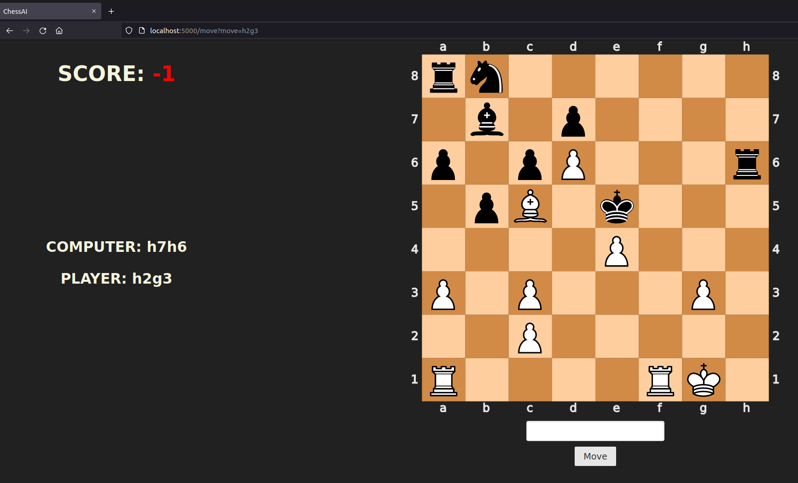

ChessAI
=====================================================

Approach to write a program that beats me in the game of chess.



**********************************

### DEPENDENCIES
- [python-chess](https://python-chess.readthedocs.io/en/latest/) - move generation, move validation and support for common formats
- [flask](https://flask.palletsprojects.com/en/1.1.x/) - lightweight WSGI web application framework
- [torch](https://pytorch.org/) - open source machine learning framework

### USAGE

```
./server.py # runs webserver on localhost:5000
```

### PROBLEM

I need an approach that evaluates a given board state and comes up with a good move to perform.

Why is it hard?
- ~10^40 legal board states
- ~10^120 different chess games
- ~30 moves per board state
- typical chess game ~80 moves

### APPROACHES

### 1st approach: [Minimax](https://en.wikipedia.org/wiki/Minimax)
- minimizing the possible loss for a worst case (maximum loss) scenario
- reasonably works up to a search depth of *3*
- already surprinsingly good opponent, but beatable
- **improvement**
    - [alpha–beta pruning](https://en.wikipedia.org/wiki/Alpha%E2%80%93beta_pruning)
    - decrease the number of nodes that are evaluated by the minimax algorithm and therefore the computation time
    - allows to search faster and works reasonably up to a depth of *4*

### 2nd approach: Neural Network
- **mapping**: board state -> move to be performed
- need a lot of chess games to train with

### TRAINING DATA

The net was trained on 110000 standard rated games played on [lichess.org ](https://database.lichess.org/) in [Portable Game Notation (PGN)](https://de.wikipedia.org/wiki/Portable_Game_Notation) format.  
Therefore, based on the above assumptions, the model was trained based on approximately 8.8M board positions.
